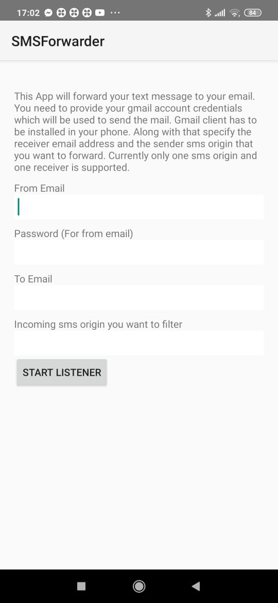
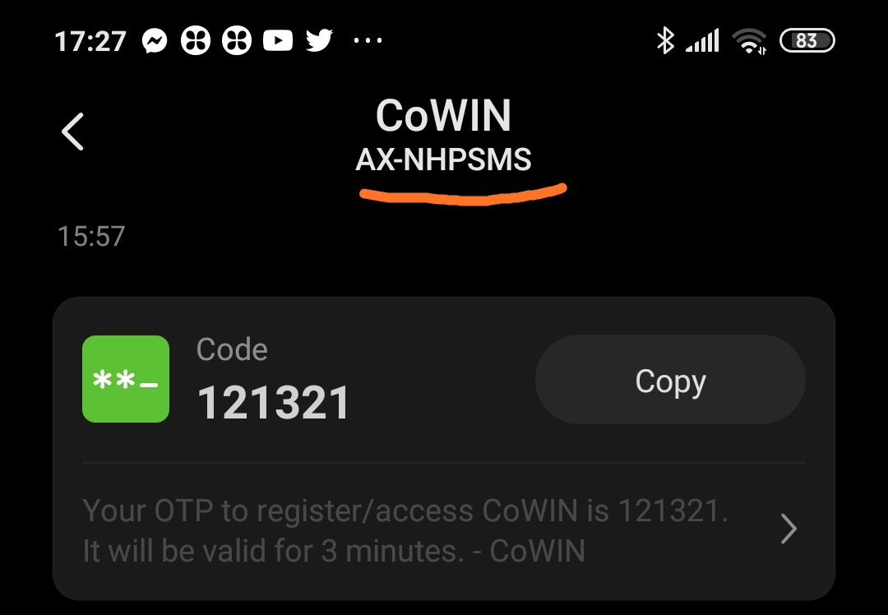

### **IMPORTANT - BEFORE YOU BEGIN**

- This is a fully automated script to book CoWin slots.
- This script automates OTP and CAPTCHA fetching hence no manual intervention is required.
- This script is a modification of this [parent script](https://github.com/dhhruv/Vac-Cowin).
- This is a Proof of Concept Project. I do NOT endorse or condone, in any shape or form, automating any monitoring/booking tasks. It's only made for Educational Purposes. Use this at your own risk.

**HowTo:**
- For Basic functionality please read README of [Vac-Cowin](https://github.com/dhhruv/Vac-Cowin)
- OTPFetcher:
CoWin OTP gets invalid in 15 mins, this script automatically requests and fetches another OTP when it gets expired.
To enable this feature you need to install [SMSForwarder.apk](https://github.com/Anwit/SMSForwarder/blob/main/SMSForwarder.apk) in your android phone. 
The app will listen to incoming sms, filter out the message from CoWin and send it to an email. This script will 
  then read the email to fetch the OTP.
  Please see README of [SMSForwarder](https://github.com/Anwit/SMSForwarder) for details. 


  **This script and SMSForwarder App supports only gmail id.**


```
➜  git:(master) ✗ python3 VacCowin.py

Running VacCowin...

=================================== IMPORTANT ===================================

This script comes with a automatic OTP fetcher. To enable this feature you need to install
SMSForwarder.apk from https://github.com/Anwit/SMSForwarder in your Android Mobile.
This App help to fetch CoWin OTP and forward it to specified email. This script will then fetch
the OTP from your email. Without this feature you need to enter the OTP manually every 15 mins
(default timeout for CoWin OTP)


Do you want to enable autoOTPCapture feature? (y/n Default n):

```
Type 'y' to enable autocapture feature.
```angular2html
Enter email id from where you want to fetch the OTP: *******@gmail.com

Enter password: ********
Enter the Registered Mobile Number: **********
Successfully Requested OTP for the Mobile Number 9483824079 at 2021-05-29 17:09:41.792808..
Validating OTP. Please Wait...
Token Generated: eyJhbGciOiJIUzI1NiIsInR5cCI6IkpXVCJ9.eyJ1c2VyX25hbWUiOiJiMjFiOTc4Mi0xMDkwLTRiZTUtYjU2Mi0wM2VmMDZkNjE5NmUiLCJ1c2VyX2lkIjoiYjIxYjk3ODItMTA5MC00YmU1LWI1NjItMDNlZjA2ZDYxOTZlIiwidXNlcl90eXBlIjoiQkVORUZJQ0lBUlkiLCJtb2JpbGVfbnVtYmVyIjo5NDgzODI0MDc5LCJiZW5lZmljaWFyeV9yZWZlcmVuY2VfaWQiOjIxNTQ0NzczMTIwNTEwLCJzZWNyZXRfa2V5IjoiYjVjYWIxNjctNzk3Ny00ZGYxLTgwMjctYTYzYWExNDRmMDRlIiwic291cmNlIjoiY293aW4iLCJ1YSI6Ik1vemlsbGEvNS4wIChNYWNpbnRvc2g7IEludGVsIE1hYyBPUyBYIDEwXzEwXzEpIEFwcGxlV2ViS2l0LzUzNy4zNiAoS0hUTUwsIGxpa2UgR2Vja28pIENocm9tZS8zOS4wLjIxNzEuOTUgU2FmYXJpLzUzNy4zNiIsImRhdGVfbW9kaWZpZWQiOiIyMDIxLTA1LTI5VDExOjM5OjUzLjE3OFoiLCJpYXQiOjE2MjIyODgzOTMsImV4cCI6MTYyMjI4OTI5M30.0IXHshb0mAZv29dWJVIyc0Hdbn0A9ilmBHx2vTukC-Y

=================================== Note ===================================

Information from a Previous Session already exists in vaccine-booking-details.json in this directory.
IMPORTANT: If you're running this application for the first time then we recommend NOT To USE THE FILE!

Would you like to see the details from that file and confirm to proceed? (y/n Default y):
```

- CAPTCHABuilder: It is enabled by default. If it is unable to identify catcha it falls back to manual mode of entering captcha


Sample UI Screen for SMSForwarder App:



Incoming sms origin you want to filter field will be the sender of CoWin sms. AX-NHPSMS for example



**Public API:**

https://apisetu.gov.in/public/api/cowin

